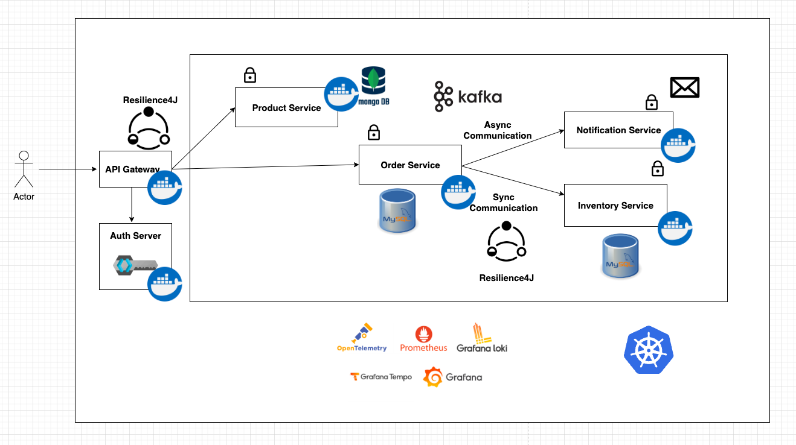

# 🚀 Spring Boot Microservice App

This repository contains a **Spring Boot microservices** application that demonstrates an end‑to‑end e‑commerce–style workflow using synchronous REST calls and asynchronous events. The system is built around independent services for products, orders, inventory management and notifications.

## 🏗 Architecture



The system is composed of several Spring Boot services and supporting infrastructure (databases, Kafka, observability stack), all containerized with Docker.

High‑level building blocks:

* **🌐 API Gateway**

    * Single entry point for all external clients.
    * Routes traffic to downstream microservices using service discovery.
    * Integrates **Resilience4j** for circuit‑breaker, retry and timeout patterns.

* **🔒 Auth Server**

    * Central authorization server securing APIs with OAuth2/JWT.
    * Sits in front of the gateway to protect backend services.

* **🛒 Product Service**

    * Manages product catalog data backed by **MongoDB**.
    * Provides CRUD APIs for products.

* **📦 Order Service**

    * Manages order creation, persistence and business logic using **MySQL**.
    * Calls Inventory Service synchronously to validate and reserve stock.
    * Publishes order events to **Kafka** for asynchronous processing by other services.

* **📦 Inventory Service**

    * Maintains product stock in its own **MySQL** database.
    * Exposes APIs for stock check and update.

* **📣 Notification Service**

    * Consumes order‑related events from **Kafka**.
    * Sends notification email to customers.

* **🗂 Eureka Server**

    * Service discovery registry where all microservices and the gateway register.

* **📊 Observability Stack**

    * **OpenTelemetry** for instrumentation, **Prometheus** for metrics, **Grafana Loki** for logs, **Grafana Tempo** for traces, visualized through **Grafana** dashboards.

* **🐳 Containerization**

    * Docker compose for all services.

## 📁 Project Structure

```text
springboot-microservice-app/
├── api-gateway/           # 🌐 Spring Cloud Gateway service
├── inventory-service/     # 📦 Inventory microservice (MySQL)
├── notification-service/  # 📣 Notification microservice (Kafka consumer)
├── order-service/         # 📦 Order microservice (MySQL, Kafka, Resilience4j)
├── product-service/       # 🛒 Product microservice (MongoDB)
└── README.md              # 📄 Project documentation
```

## ✅ Features

* 🌐 API Gateway with routing, load balancing and resilience patterns.
* 🏗 Independent microservices with their own databases (polyglot persistence: MongoDB + MySQL).
* 🔄 Synchronous REST communication for critical calls (order → inventory).
* ⚡ Asynchronous, event‑driven communication using Apache Kafka for notifications.
* 🗂 Service discovery using Eureka.
* 🔒 Security with OAuth2/JWT via a dedicated Auth Server.
* 📊 Production‑grade observability with OpenTelemetry, Prometheus, Loki, Tempo and Grafana.

## 🛠 Prerequisites

* ☑ Java 21
* ☑ Maven
* ☑ Docker & Docker Compose

## 🏃‍♂️ Getting Started (Local with Docker Compose)

Each service contains its own `docker-compose.yml` for local setup.

1. Clone the repository

```bash
git clone https://github.com/alfredjose17/springboot-microservice-app.git
cd springboot-microservice-app
```

2. Build and start a service (example: Product Service)

```bash
cd product-service
mvn clean install
docker compose up -d
```

Repeat for other services. ✅ This will typically start the service with its database (if needed) and any dependent infrastructure.

3. Access the service

* 🌐 API endpoints are exposed on ports defined in each service's `docker-compose.yml`.

## 🔄 Sample Flow

1. 🛒 Create products via Product Service (through the gateway).
2. 📦 Place an order; the Order Service checks the Inventory Service synchronously and reserves stock.
3. 📣 An order event is emitted to Kafka, consumed by Notification Service, which triggers a notification to the customer.
4. 📊 Inspect traces, metrics and logs in Grafana/Prometheus/Loki/Tempo to see the full request path across services.

## 🧰 Technologies Used

| Area           | Stack                                                         |
| -------------- | ------------------------------------------------------------- |
| Core framework | Spring Boot, Spring Web, Spring Data JPA, Spring Data MongoDB |
| Cloud patterns | Spring Cloud Gateway, Eureka Service Discovery, Resilience4j  |
| Messaging      | Apache Kafka                                                  |
| Databases      | MySQL, MongoDB                                                |
| Security       | Spring Security, OAuth2/JWT (Auth Server)                     |
| Observability  | OpenTelemetry, Prometheus, Grafana, Loki, Tempo               |
| Platform       | Docker, Docker Compose                                        |

## 🌟 Future Scope

* [x]🏗 Parent Maven project (`pom.xml`) for multi-module management.
* [ ]🐳 Kubernetes deployment manifests and full cluster setup.
* [ ]⚙️ CI/CD pipelines using GitHub Actions to automatically build and deploy images.
* [ ]🔒 Harden security and integrate Auth Server fully across services.
* [ ]📊 Extend observability dashboards with business‑level metrics (orders created, failed payments, etc.).
